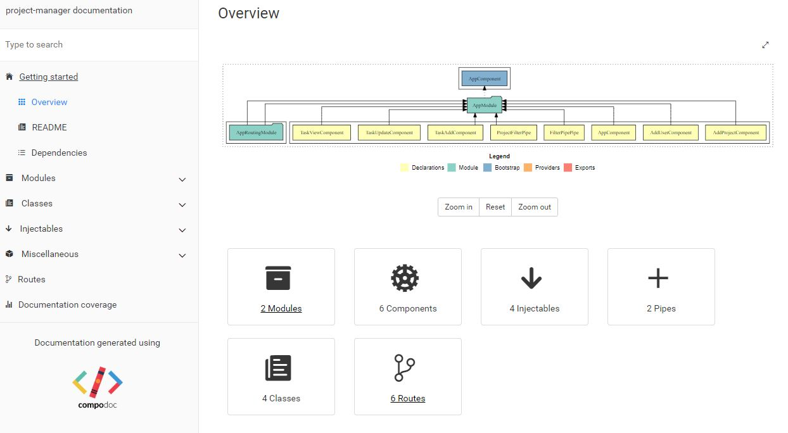

# Project Manager Backend Service

The  Project  Manager  Single  Page  Application allows  you  to  manage  projects  and their  respective tasks. 
It allows you to set priorities to each project and task. You can associate one manager to each project 
and task-owner for  each task. Each task will have parent task,  start date, end date and task owner.
 
**Below are the features of Project Manager:**
1. Add/Edit/View/Delete User
2. Add/Edit/View/Delete Project
3. Add/Edit/View/Delete Task
4. You can make one task a parent of another task. 
5. On view task screen:
    * User can search tasks by project name and sort by start date, end date or completed status.
    * User can edit task
    * User can end the task once it is finished. Once ended, user cannot edit the task. 
        User can only view the task once finished.

##Pre Requisite
* Java
* npm
* Docker
* Docker-compose - version 3

##Technologies/Frameworks:
* Spring boot
* angualar
* mango database

* Docker
* Maven 
* npm
* jenkins for CI

## Back End service ( Tasks)

 * Backend is a spring boot app.
 * Use nosql database -  mango
 
 * **Build** 
``` mvn clean install ```
* **To Docker Repo** ```docker push manoharanrajesh/task-manager-service```

## Frontend/UI Task manager

 * **Build** ```npm install && npm run build --prod```
 
 Read more [here](./ui/documentation/index.html)
 
 
## Run All

* ```docker-compose up```

## Jenkins master image

check the jenkins folder. 
* **Pre requisite** : 
     * Add credentials for the docker hub ,  git.
     * Volume to socket from host. --> Windows 10 in the  path set COMPOSE_CONVERT_WINDOWS_PATHS=1
                                                  -v //var/run/docker.sock:/var/run/docker.sock                                               
                                                 
* **Run** ```cd jenkins &&  docker-compose up```

### Login details
* User:jenkins
* password:jenkins

 Add following credentials to jenkins 
 * dockerHub
 * git

## Docker Repo

* Backend           :  manoharanrajesh/project-manager-service
* FrontEnd          : manoharanrajesh/project-manager-ui
* CI/CD(Jenkins)    : manoharanrajesh/jenkins

## Sonar report

* ```mvn clean install sonar:sonar -Dsonar.host.url=http://localhost:9000```
 Based on docker image https://hub.docker.com/_/sonarqube

## Jmeter 

* ```cd service && mvn clean verify -Pjmeter```

